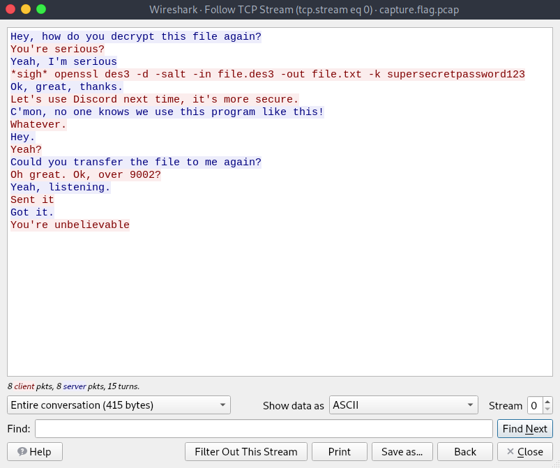
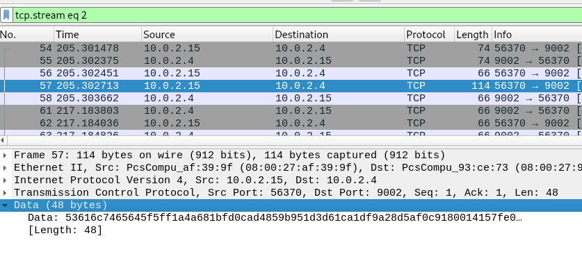

# picoCTF 2022

> Arvind Shima | March 16,2022

## Overview

| Tables | Description |
| ------ | ----------- |
| Category | Forensics |
| Challenge Name | Eavesdrop |
| Points | 300 |

## Description

Download this packet capture and find the flag.

#### Hint

- All we know is that this packet capture includes a chat conversation and a file transfer.

## Approach

Open the pcap file on Wireshark and Follow the TCP Stream.



In the conversation, They've shared DES Encrypted file.txt over the port 9002. Let's export the packet and decode the file.txt



```bash
openssl des3 -d -salt -in file.dat -out file.txt -k supersecretpassword123
```

## Flag

```
picoCTF{nc_73115_411_5786acc3}
```
