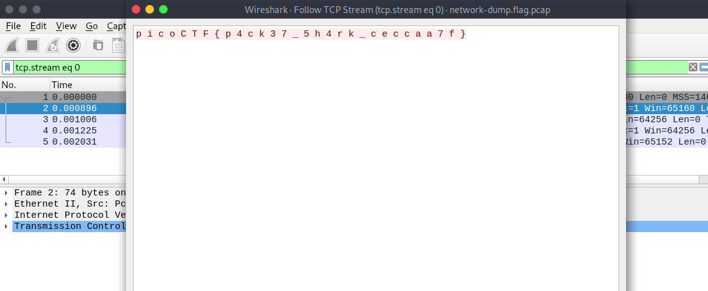

# picoCTF 2022

> Arvind Shima | March 16,2022

## Overview

| Tables | Description |
| ------ | ----------- |
| Category | Forensics |
| Challenge Name | Packets Primer |
| Points | 100 |

## Description

Download the packet capture file and use packet analysis software to find the flag.

#### Hint

- Wireshark, if you can install and use it, is probably the most beginner friendly packet analysis software product.

## Approach

Open the pcap file on Wireshark and Follow the TCP Stream.



## Flag

```
picoCTF{p4ck37_5h4rk_ceccaa7f}
```
