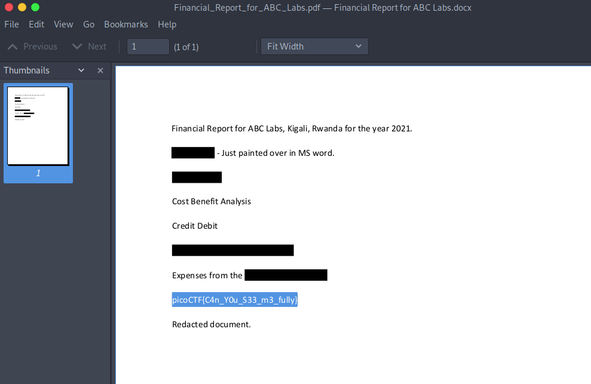

# picoCTF 2022

> Arvind Shima | March 16,2022

## Overview

| Tables | Description |
| ------ | ----------- |
| Category | Forensics |
| Challenge Name | Redaction gone wrong |
| Points | 100 |

## Description

Now you DON’T see me.
This report has some critical data in it, some of which have been redacted correctly, while some were not. Can you find an important key that was not redacted properly?

#### Hint

- How can you be sure of the redaction?

## Approach

Open the PDF and Just double tap on the redaction.



## Flag

```
picoCTF{C4n_Y0u_S33_m3_fully}
```
