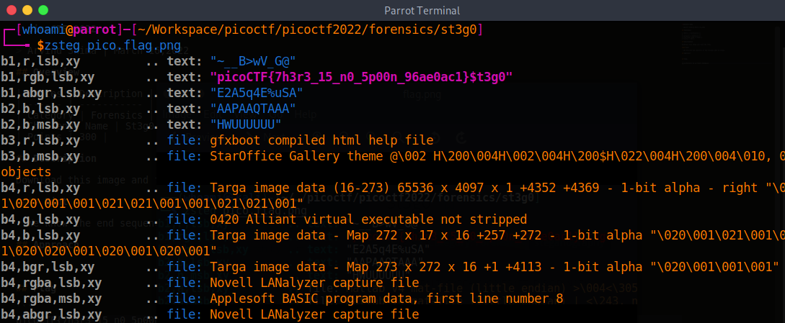

# picoCTF 2022

> Arvind Shima | March 16,2022

## Overview

| Tables | Description |
| ------ | ----------- |
| Category | Forensics |
| Challenge Name | St3g0 |
| Points | 300 |

## Description

Download this image and find the flag.

#### Hint

- We know the end sequence of the message will be $t3g0.

## Approach

A `zsteg` is stegnography tool which can able to find the hidden data in BMP and PNG type images.



## Flag

```
picoCTF{7h3r3_15_n0_5p00n_96ae0ac1}
```
