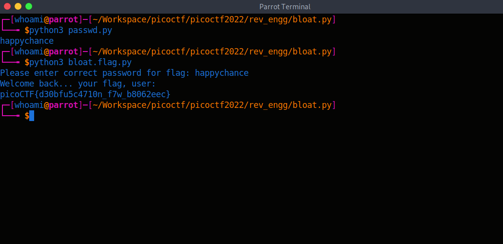

# picoCTF 2022

> Arvind Shima | March 18,2022

## Overview

| Tables | Description |
| ------ | ----------- |
| Category | Reverse Engineering |
| Challenge Name | bloat.py |
| Points | 200 |

## Description

Can you get the flag?
Run this Python program in the same directory as this encrypted flag.

## Approach

```python
import sys
a = "!\"#$%&'()*+,-./0123456789:;<=>?@ABCDEFGHIJKLMNOPQRSTUVWXYZ"+ \
            "[\\]^_`abcdefghijklmnopqrstuvwxyz{|}~ "
def arg133(arg432):
  if arg432 == a[71]+a[64]+a[79]+a[79]+a[88]+a[66]+a[71]+a[64]+a[77]+a[66]+a[68]:
    return True
  else:
    print(a[51]+a[71]+a[64]+a[83]+a[94]+a[79]+a[64]+a[82]+a[82]+a[86]+a[78]+\
a[81]+a[67]+a[94]+a[72]+a[82]+a[94]+a[72]+a[77]+a[66]+a[78]+a[81]+\
a[81]+a[68]+a[66]+a[83])
    sys.exit(0)
    return False
def arg111(arg444):
  return arg122(arg444.decode(), a[81]+a[64]+a[79]+a[82]+a[66]+a[64]+a[75]+\
a[75]+a[72]+a[78]+a[77])
def arg232():
  return input(a[47]+a[75]+a[68]+a[64]+a[82]+a[68]+a[94]+a[68]+a[77]+a[83]+\
a[68]+a[81]+a[94]+a[66]+a[78]+a[81]+a[81]+a[68]+a[66]+a[83]+\
a[94]+a[79]+a[64]+a[82]+a[82]+a[86]+a[78]+a[81]+a[67]+a[94]+\
a[69]+a[78]+a[81]+a[94]+a[69]+a[75]+a[64]+a[70]+a[25]+a[94])
def arg132():
  return open('flag.txt.enc', 'rb').read()
def arg112():
  print(a[54]+a[68]+a[75]+a[66]+a[78]+a[76]+a[68]+a[94]+a[65]+a[64]+a[66]+\
a[74]+a[13]+a[13]+a[13]+a[94]+a[88]+a[78]+a[84]+a[81]+a[94]+a[69]+\
a[75]+a[64]+a[70]+a[11]+a[94]+a[84]+a[82]+a[68]+a[81]+a[25])
def arg122(arg432, arg423):
    arg433 = arg423
    i = 0
    while len(arg433) < len(arg432):
        arg433 = arg433 + arg423[i]
        i = (i + 1) % len(arg423)        
    return "".join([chr(ord(arg422) ^ ord(arg442)) for (arg422,arg442) in zip(arg432,arg433)])
arg444 = arg132()
arg432 = arg232()
arg133(arg432)
arg112()
arg423 = arg111(arg444)
print(arg423)
sys.exit(0)

```

After analysed the source code, All defined function's have some values which is indexed to the variable `a` and Also the function `arg133` have a condition of `arg432` is equal to the exist value will return the statement as `True`. Let's decode it with python.

```python
#!/usr/bin/python3

a = "!\"#$%&'()*+,-./0123456789:;<=>?@ABCDEFGHIJKLMNOPQRSTUVWXYZ"+ \
            "[\\]^_`abcdefghijklmnopqrstuvwxyz{|}~ "

d = a[71]+a[64]+a[79]+a[79]+a[88]+a[66]+a[71]+a[64]+a[77]+a[66]+a[68]

print("".join(d))

"""
Output : happychance
"""
```

Run the program.



## Flag

```
picoCTF{d30bfu5c4710n_f7w_b8062eec}
```
