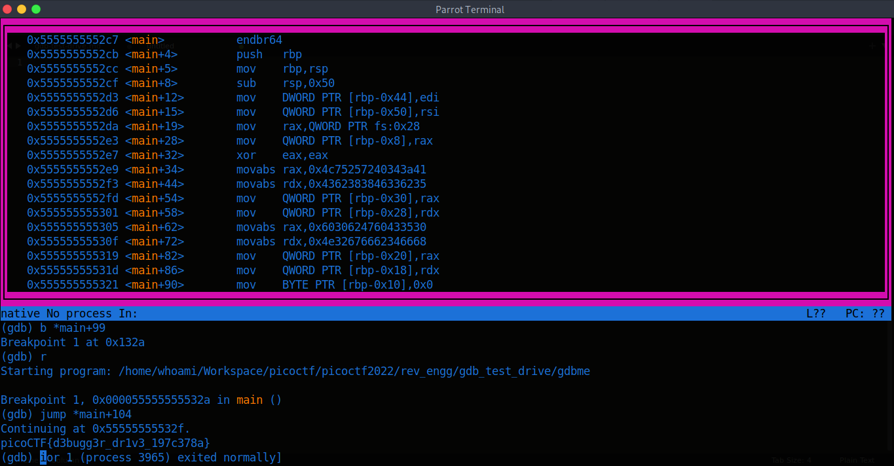

# picoCTF 2022

> Arvind Shima | March 17,2022

## Overview

| Tables | Description |
| ------ | ----------- |
| Category | Reverse Engineering |
| Challenge Name | GDB Test Drive |
| Points | 100 |

## Description

Can you get the flag?

Here's the test drive instructions:

```bash
$ chmod +x gdbme
$ gdb gdbme
(gdb) layout asm
(gdb) break *(main+99)
(gdb) run
(gdb) jump *(main+104)
```

## Approach

Let's execute the binary in gdb and disassemble main.

### GDB (debugger)

```bash
(gdb) disassemble main 
Dump of assembler code for function main:
   0x00000000000012c7 <+0>:	endbr64 
   0x00000000000012cb <+4>:	push   rbp
   0x00000000000012cc <+5>:	mov    rbp,rsp
   0x00000000000012cf <+8>:	sub    rsp,0x50
   0x00000000000012d3 <+12>:	mov    DWORD PTR [rbp-0x44],edi
   0x00000000000012d6 <+15>:	mov    QWORD PTR [rbp-0x50],rsi
   0x00000000000012da <+19>:	mov    rax,QWORD PTR fs:0x28
   0x00000000000012e3 <+28>:	mov    QWORD PTR [rbp-0x8],rax
   0x00000000000012e7 <+32>:	xor    eax,eax
   0x00000000000012e9 <+34>:	movabs rax,0x4c75257240343a41
   0x00000000000012f3 <+44>:	movabs rdx,0x4362383846336235
   0x00000000000012fd <+54>:	mov    QWORD PTR [rbp-0x30],rax
   0x0000000000001301 <+58>:	mov    QWORD PTR [rbp-0x28],rdx
   0x0000000000001305 <+62>:	movabs rax,0x6030624760433530
   0x000000000000130f <+72>:	movabs rdx,0x4e32676662346668
   0x0000000000001319 <+82>:	mov    QWORD PTR [rbp-0x20],rax
   0x000000000000131d <+86>:	mov    QWORD PTR [rbp-0x18],rdx
   0x0000000000001321 <+90>:	mov    BYTE PTR [rbp-0x10],0x0
   0x0000000000001325 <+94>:	mov    edi,0x186a0
   0x000000000000132a <+99>:	call   0x1110 <sleep@plt>
   0x000000000000132f <+104>:	lea    rax,[rbp-0x30]
   0x0000000000001333 <+108>:	mov    rsi,rax
   0x0000000000001336 <+111>:	mov    edi,0x0
   0x000000000000133b <+116>:	call   0x1209 <rotate_encrypt>
   0x0000000000001340 <+121>:	mov    QWORD PTR [rbp-0x38],rax
   0x0000000000001344 <+125>:	mov    rdx,QWORD PTR [rip+0x2cc5]        # 0x4010 <stdout@@GLIBC_2.2.5>
   0x000000000000134b <+132>:	mov    rax,QWORD PTR [rbp-0x38]
   0x000000000000134f <+136>:	mov    rsi,rdx
   0x0000000000001352 <+139>:	mov    rdi,rax
   0x0000000000001355 <+142>:	call   0x10f0 <fputs@plt>
   0x000000000000135a <+147>:	mov    edi,0xa
   0x000000000000135f <+152>:	call   0x10c0 <putchar@plt>
   0x0000000000001364 <+157>:	mov    rax,QWORD PTR [rbp-0x38]
   0x0000000000001368 <+161>:	mov    rdi,rax
   0x000000000000136b <+164>:	call   0x10b0 <free@plt>
   0x0000000000001370 <+169>:	mov    eax,0x0
   0x0000000000001375 <+174>:	mov    rcx,QWORD PTR [rbp-0x8]
   0x0000000000001379 <+178>:	xor    rcx,QWORD PTR fs:0x28
   0x0000000000001382 <+187>:	je     0x1389 <main+194>
   0x0000000000001384 <+189>:	call   0x10e0 <__stack_chk_fail@plt>
   0x0000000000001389 <+194>:	leave  
   0x000000000000138a <+195>:	ret    
End of assembler dump.
```

When running this binary, It doesn't provide anything. Once after disassembled this main function. The execution part is gone to sleep, This is why we break the main to `*(main+99)` and jump over to `*(main+104)` address to get the flag.



## Flag

```
picoCTF{d3bugg3r_dr1v3_197c378a}
```
