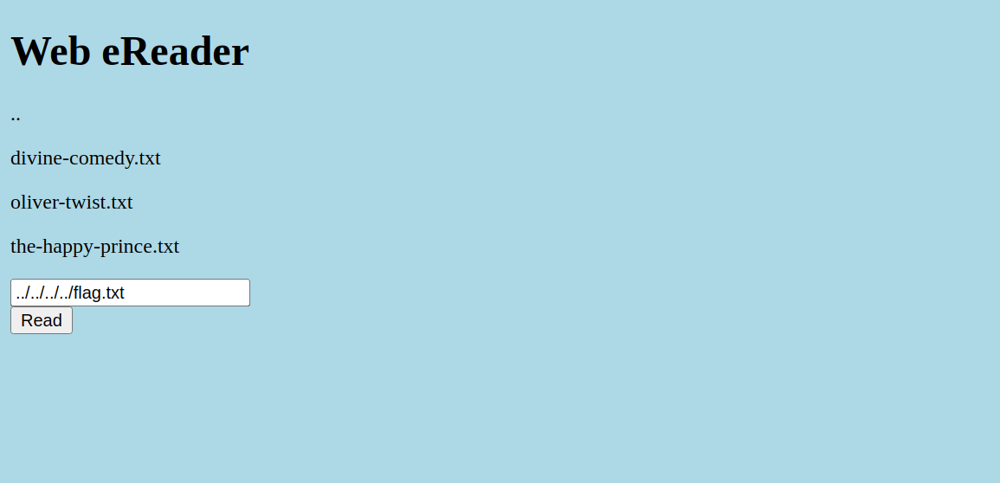

# picoCTF 2022

> Arvind Shima | March 16,2022

## Overview

| Tables | Description |
| ------ | ----------- |
| Category | Web Exploitation |
| Challenge Name | Forbidden Paths |
| Points | 200 |

## Description

Can you get the flag?
Here's the website.
We know that the website files live in /usr/share/nginx/html/ and the flag is at /flag.txt but the website is filtering absolute file paths. Can you get past the filter to read the flag?

## Approach

### LFI Attack (Local File Inclusion)



## Flag

```
picoCTF{7h3_p47h_70_5ucc355_6db46514}
```
