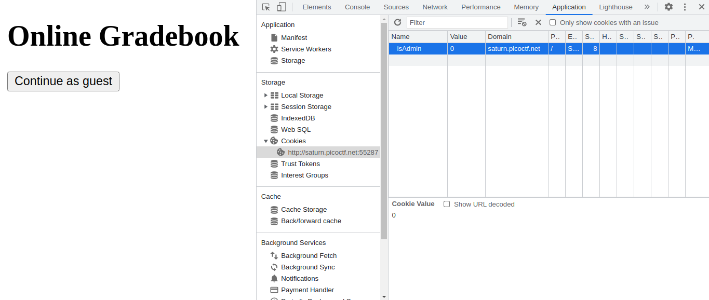
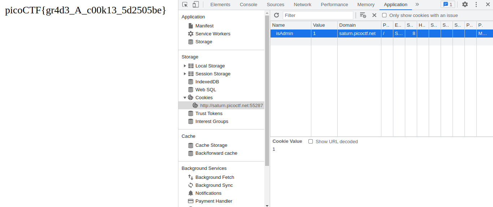

# picoCTF 2022

> Arvind Shima | March 16,2022

## Overview

| Tables | Description |
| ------ | ----------- |
| Category | Web Exploitation |
| Challenge Name | Power Cookie |
| Points | 200 |

## Description

Can you get the flag?

#### Hint

- Do you know how to modify cookies?

## Approach

In Chrome, `Inspect > Application > Cookies` modify the `isAdmin` value 0 to 1 and Refresh the page.





## Flag

```
picoCTF{gr4d3_A_c00k13_5d2505be}
```
