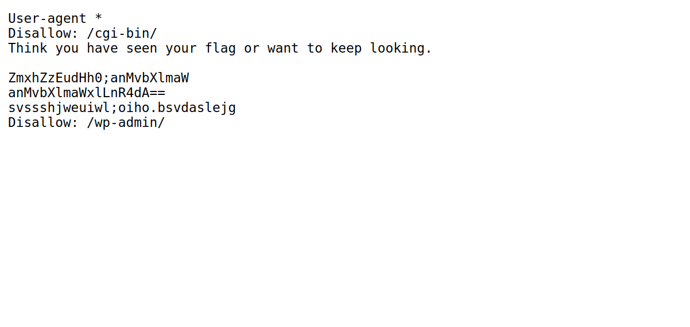

# picoCTF 2022

> Arvind Shima | March 16,2022

## Overview

| Tables | Description |
| ------ | ----------- |
| Category | Web Exploitation |
| Challenge Name | Roboto Sans |
| Points | 200 |

## Description

The flag is somewhere on this web application not necessarily on the website. Find it.

## Approach

Take a look at `/robots.txt`.



We have some base64 encoded strings. Let's decode the strings.

```bash
echo -n ZmxhZzEudHh0 | base64 -d # Output: flag1.txt
echo -n anMvbXlmaWxlLnR4dA==| base64 -d # Output: js/myfile.txt
```

We have one vaild path. Take a look on `http://saturn.picoctf.net:65352/js/myfile.txt`.

## Flag

```
picoCTF{Who_D03sN7_L1k5_90B0T5_718c9043}
```
