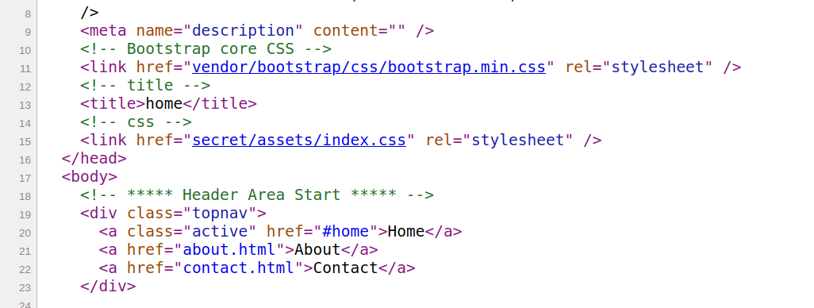
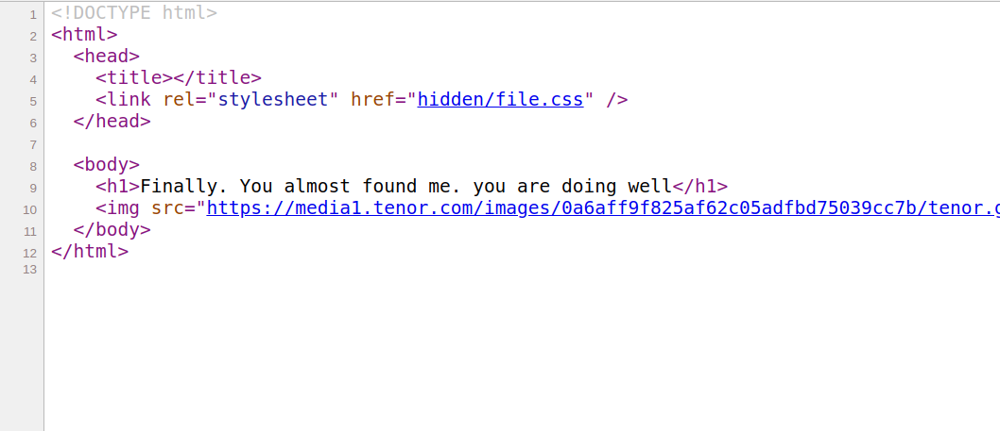
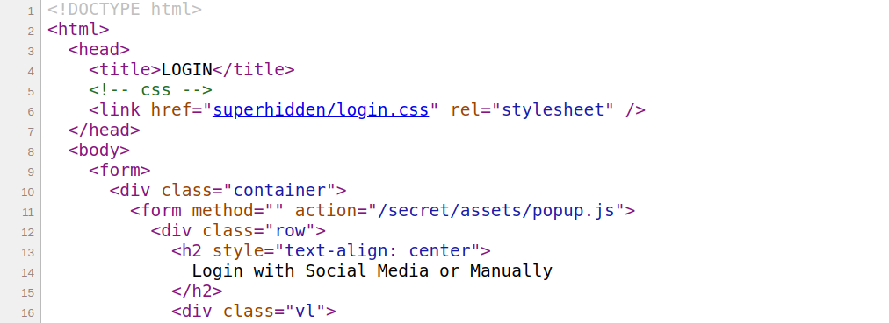
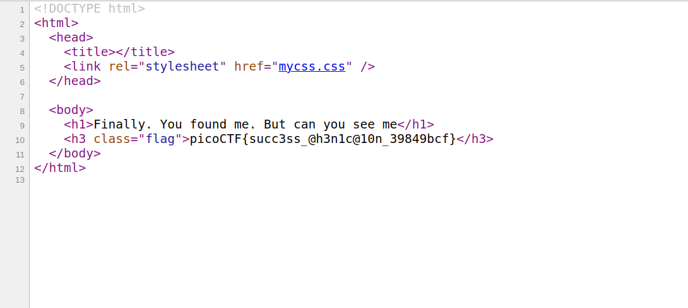

# picoCTF 2022

> Arvind Shima | March 16,2022

## Overview

| Tables | Description |
| ------ | ----------- |
| Category | Web Exploitation |
| Challenge Name | Secrets |
| Points | 200 |

## Description

We have several pages hidden. Can you find the one with the flag?

#### Hints

- folders folders folders

## Approach

In this challenge, The hint mentioned as `folders` again and again. So, I manually looking forward for folders were refered to `href` through viewing the source code.

An index page refers to `/secret/` path.



A secret path refers to `/hidden/` path.



A hidden path refers to `/superhidden/` path.



Here's the flag.



## Flag

```
picoCTF{succ3ss_@h3n1c@10n_39849bcf}
```
